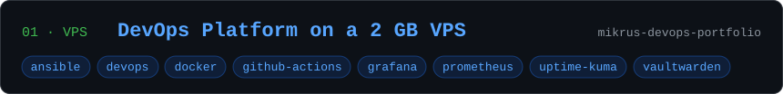
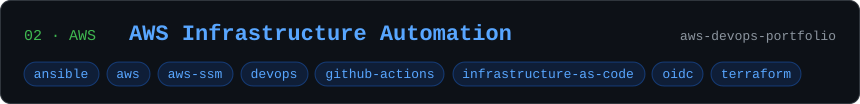
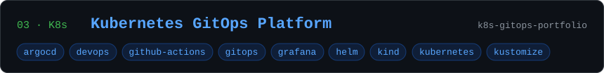

  

  <a href="https://www.linkedin.com/in/micha%C5%82-jakubowski-46908b43b/">LinkedIn</a> · <a href="#projects">Projects</a> · <a href="#tech-stack">Tech stack</a>

### `$ whoami`

At work I run Linux infrastructure on KVM and VMware vCenter and take part in an AWS Landing Zone rollout with Terraform and Entra ID SSO. Outside work I build the same small platform three times, on a VPS, on AWS and on Kubernetes, and make CI prove each one works before I call it done.

### `$ cat focus.md`

- **Everything as code:** Terraform, Ansible, Helm and Kustomize. Nothing on a server is configured by hand.
- **CI that proves it:** the second Ansible run must report `changed=0`, IAM permissions are checked in the policy simulator, and every Kubernetes commit runs end-to-end on a fresh kind cluster.
- **Secure defaults:** OIDC instead of stored cloud keys, SSM instead of SSH, Sealed Secrets, least-privilege roles.
- **Observability built in:** Prometheus, Grafana and Uptime Kuma are provisioned together with the services.
- **Next:** AWS Certified Cloud Practitioner (planned 11.2026), then RHCSA (planned 01.2027).

### `$ ls ~/projects`

Six self-hosted services managed by Ansible and Docker. Every push deploys and fails unless the second Ansible run reports `changed=0`. 

The same Ansible roles on AWS. Terraform, OIDC instead of keys, SSM instead of SSH, a least-privilege role tested in the IAM policy simulator. 

The same services on Kubernetes, deployed only by Argo CD. Every commit builds a kind cluster in CI and runs 13 end-to-end checks. 

### `$ tech-stack --list`

### `$ git log --graph`

<picture>
  <source media="(prefers-color-scheme: dark)" srcset="https://raw.githubusercontent.com/michaljakubowski2001/michaljakubowski2001/output/github-snake-dark.svg">
  <source media="(prefers-color-scheme: light)" srcset="https://raw.githubusercontent.com/michaljakubowski2001/michaljakubowski2001/output/github-snake.svg">
  
</picture>

Every image above is an SVG rendered from <a href="profile.json"><code>profile.json</code></a> and the GitHub API by <a href="scripts/render.py"><code>scripts/render.py</code></a>, refreshed daily by <a href=".github/workflows/profile.yml">GitHub Actions</a>.
